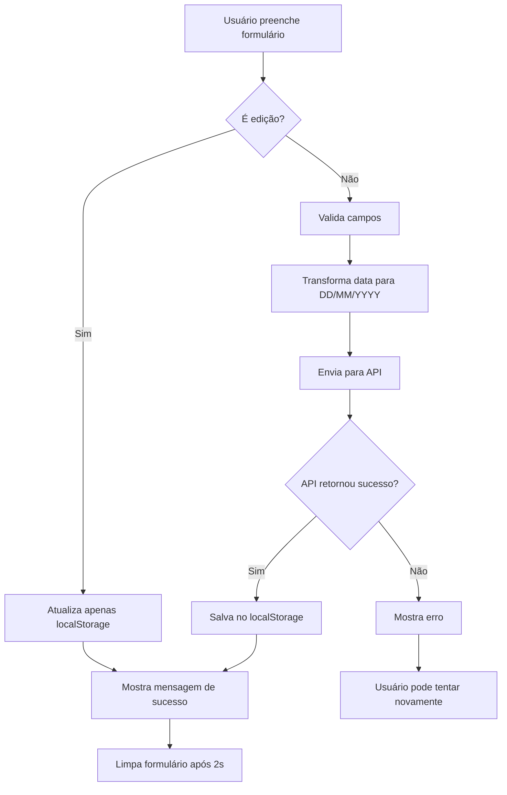

# Teste de API - Cadastro de Funcionários

## 📋 Visão Geral

Este documento fornece instruções para testar a integração com a API de cadastro de funcionários.

## 🔧 Configuração

### Variáveis de Ambiente

Certifique-se de que o arquivo `.env` contém:

```env
NEXT_PUBLIC_CADASTRO_FUNCIONARIO_ENV=https://n8n-n8n.tscd6m.easypanel.host/webhook/ab501d72-e6cf-45fe-ac38-793abe372597
```

⚠️ **Importante**: A variável com `NEXT_PUBLIC_` é exposta no cliente (browser).

## 🧪 Teste Manual via cURL

### Exemplo de Requisição

```bash
curl -X POST https://n8n-n8n.tscd6m.easypanel.host/webhook/ab501d72-e6cf-45fe-ac38-793abe372597 \
  -H "Content-Type: application/json" \
  -d '{
    "nomeCompleto": "João Silva Santos",
    "matricula": "251013698",
    "data_nascimento": "15/06/1990"
  }'
```

### Formato do Payload

```json
{
  "nomeCompleto": "string",
  "matricula": "string",
  "data_nascimento": "DD/MM/YYYY"
}
```

⚠️ **Atenção ao formato da data**: A API espera `DD/MM/YYYY` (ex: "15/06/1990").

### Resposta Esperada

A resposta pode variar dependendo da configuração do webhook no n8n. Exemplos possíveis:

```json
{
  "success": true,
  "message": "Funcionário cadastrado com sucesso",
  "id": "12345"
}
```

ou

```json
{
  "status": "success"
}
```

## 🌐 Teste via Aplicação Web

### 1. Inicie o servidor de desenvolvimento

```bash
npm run dev
```

### 2. Acesse o painel de gerenciamento

Navegue para: `http://localhost:3000/dashboard/employees`

⚠️ **Nota**: Esta é uma rota privada. Você precisa estar autenticado.

### 3. Cadastre um novo funcionário

1. Clique no botão **"Novo"**
2. Preencha o formulário:
   - **Nome Completo**: João Silva Santos
   - **Matrícula**: 251013698
   - **Data de Nascimento**: 15/06/1990
3. Clique em **"Salvar"**

### 4. Verifique o resultado

#### ✅ Sucesso

- Mensagem verde: "Funcionário cadastrado com sucesso!"
- Funcionário aparece na lista
- Dados salvos no localStorage como backup

#### ❌ Erro

- Mensagem vermelha com descrição do erro
- Verifique o console do navegador para detalhes

## 🔍 Debugging

### Verificar no Console do Navegador

1. Abra o DevTools (F12)
2. Vá para a aba **Console**
3. Procure por:
   - `Enviando cadastro de funcionário para API:` - mostra o payload
   - `Resposta da API de cadastro:` - mostra a resposta
   - `Funcionário cadastrado na API:` - confirma sucesso

### Verificar Requisições na Aba Network

1. Abra o DevTools (F12)
2. Vá para a aba **Network**
3. Cadastre um funcionário
4. Procure pela requisição para o webhook
5. Clique nela para ver:
   - **Headers**: Cabeçalhos da requisição
   - **Payload**: Dados enviados (formato JSON)
   - **Response**: Resposta da API

### Exemplo de Log no Console

```javascript
Enviando cadastro de funcionário para API: {
  url: "https://n8n-n8n.tscd6m.easypanel.host/webhook/...",
  payload: {
    nomeCompleto: "João Silva Santos",
    matricula: "251013698",
    data_nascimento: "15/06/1990"
  }
}

Resposta da API de cadastro: {
  success: true,
  message: "Funcionário cadastrado com sucesso"
}

Funcionário cadastrado na API: {
  success: true,
  message: "Funcionário cadastrado com sucesso"
}
```

### Erros Comuns

#### 1. "URL da API não configurada"

**Causa**: Variável de ambiente não encontrada
**Solução**:

- Verifique se `.env` contém `NEXT_PUBLIC_CADASTRO_FUNCIONARIO_ENV`
- Reinicie o servidor de desenvolvimento (`npm run dev`)
- A variável DEVE ter o prefixo `NEXT_PUBLIC_`

#### 2. "Erro de conexão. Verifique sua internet"

**Causa**: Falha na conexão de rede
**Solução**:

- Verifique sua conexão com a internet
- Teste a URL do webhook com curl no terminal
- Verifique se o webhook está ativo no n8n

#### 3. "Preencha todos os campos"

**Causa**: Campos obrigatórios não preenchidos
**Solução**: Preencha todos os três campos (Nome, Matrícula, Data)

#### 4. "Erro HTTP: 404" ou "Erro HTTP: 500"

**Causa**: Webhook não encontrado ou erro no servidor
**Solução**:

- Verifique se a URL do webhook está correta
- Verifique se o workflow no n8n está ativo
- Verifique os logs do n8n para mais detalhes

## 📊 Estrutura do Payload

### Mapeamento de Campos

| Campo do Formulário | Campo da API      | Formato    | Obrigatório | Exemplo             |
| ------------------- | ----------------- | ---------- | ----------- | ------------------- |
| `name`              | `nomeCompleto`    | String     | ✅          | "João Silva Santos" |
| `matricula`         | `matricula`       | String     | ✅          | "251013698"         |
| `dataNascimento`    | `data_nascimento` | DD/MM/YYYY | ✅          | "15/06/1990"        |

### Transformação de Data

O formulário usa `<input type="date">` que retorna formato `YYYY-MM-DD`:

- **Entrada do usuário**: 1990-06-15
- **Transformado para API**: 15/06/1990

```typescript
// Código de transformação
const [year, month, day] = form.dataNascimento.split("-");
const dataFormatada = `${day}/${month}/${year}`;
```

### Exemplo de Payload Completo

```json
{
  "nomeCompleto": "Maria Oliveira Costa",
  "matricula": "251013699",
  "data_nascimento": "22/03/1985"
}
```

## 💾 Armazenamento Local

### Salvamento Automático

Após o cadastro bem-sucedido na API, os dados são salvos automaticamente no `localStorage` do navegador:

```javascript
// Estrutura do funcionário salvo
{
  id: "1699459200000",
  name: "João Silva Santos",
  matricula: "251013698",
  dataNascimento: "1990-06-15",
  createdAt: "2025-11-08T14:30:00.000Z"
}
```

### Acessar Dados no Console

```javascript
// Ver todos os funcionários salvos
const employees = JSON.parse(localStorage.getItem("employees") || "[]");
console.table(employees);

// Contar funcionários
console.log(`Total de funcionários: ${employees.length}`);

// Limpar todos os funcionários (use com cuidado!)
// localStorage.removeItem('employees');
```

## 🔄 Diferença entre Cadastro e Edição

### Cadastro (Novo Funcionário)

1. ✅ Envia dados para API (`registerEmployee()`)
2. ✅ Salva no localStorage
3. ✅ Mostra mensagem de sucesso
4. ✅ Limpa o formulário após 2 segundos

### Edição (Funcionário Existente)

1. ❌ **NÃO** envia para API
2. ✅ Apenas atualiza no localStorage
3. ✅ Mostra mensagem de sucesso
4. ❌ **NÃO** limpa o formulário

## 🎯 Fluxo Completo



## 🔐 Segurança

⚠️ **Avisos de Segurança**:

1. A URL do webhook está exposta no código client-side
2. Qualquer pessoa pode enviar dados para o webhook
3. Não há autenticação implementada
4. Não há validação de matrícula duplicada na API

**Recomendações**:

- Implementar autenticação no webhook (token, API key)
- Validar matrícula única no backend
- Adicionar rate limiting para prevenir abuso
- Validar formato de dados no servidor (n8n)
- Considerar usar Next.js API Route como intermediário

## ✅ Checklist de Teste

### Cadastro Novo

- [ ] Servidor de desenvolvimento rodando
- [ ] Variável de ambiente configurada
- [ ] Acessar página `/dashboard/employees`
- [ ] Clicar em "Novo"
- [ ] Preencher todos os campos
- [ ] Clicar em "Salvar"
- [ ] Verificar mensagem de sucesso
- [ ] Verificar funcionário na lista
- [ ] Verificar logs no console
- [ ] Verificar requisição na aba Network
- [ ] Verificar dados no n8n/banco de dados
- [ ] Verificar localStorage

### Edição

- [ ] Selecionar funcionário existente
- [ ] Clicar no botão de editar (ícone de lápis)
- [ ] Modificar algum campo
- [ ] Clicar em "Salvar"
- [ ] Verificar mensagem de sucesso
- [ ] Verificar alteração na lista
- [ ] **Confirmar que NÃO enviou para API** (verificar Network)

### Tratamento de Erros

- [ ] Tentar enviar formulário vazio
- [ ] Desconectar internet e tentar cadastrar
- [ ] Verificar mensagens de erro apropriadas

## 📝 Exemplos de Teste

### Caso 1: Cadastro Bem-Sucedido

**Input**:

```
Nome Completo: Ana Paula Rodrigues
Matrícula: 123456789
Data de Nascimento: 10/01/2007
```

**Payload enviado**:

```json
{
  "nomeCompleto": "Ana Paula Rodrigues",
  "matricula": "123456789",
  "data_nascimento": "10/01/2007"
}
```

**Resultado esperado**:

- ✅ Mensagem verde de sucesso
- ✅ Funcionário na lista
- ✅ Console: logs de envio e resposta
- ✅ Network: requisição POST com status 200

### Caso 2: Erro de Validação

**Input**:

```
Nome Completo: (vazio)
Matrícula: 123456789
Data de Nascimento: 10/01/2007
```

**Resultado esperado**:

- ❌ Mensagem vermelha: "Preencha todos os campos"
- ❌ Não envia para API
- ❌ Não adiciona à lista

### Caso 3: Erro de Conexão

**Condição**: Internet desconectada

**Resultado esperado**:

- ❌ Mensagem vermelha: "Erro de conexão. Verifique sua internet e tente novamente."
- ❌ Console: erro de fetch
- ❌ Não adiciona à lista

## 🚀 Próximos Passos

- [ ] Implementar validação de matrícula única
- [ ] Adicionar confirmação antes de cadastrar
- [ ] Implementar busca de funcionário por matrícula
- [ ] Adicionar campo de foto do funcionário
- [ ] Implementar importação em lote (CSV/Excel)
- [ ] Criar relatório de funcionários cadastrados
- [ ] Adicionar filtros e ordenação na lista
- [ ] Implementar paginação para muitos registros
- [ ] Adicionar testes automatizados
- [ ] Implementar sincronização bidirecional com API

## 📞 Suporte

Se encontrar problemas:

1. Verifique o console do navegador para erros
2. Verifique a aba Network para detalhes da requisição
3. Verifique os logs do n8n
4. Revise este documento para soluções comuns
5. Verifique se a variável de ambiente está correta
6. Verifique o formato da data (DD/MM/YYYY)
7. Entre em contato com a equipe de desenvolvimento
