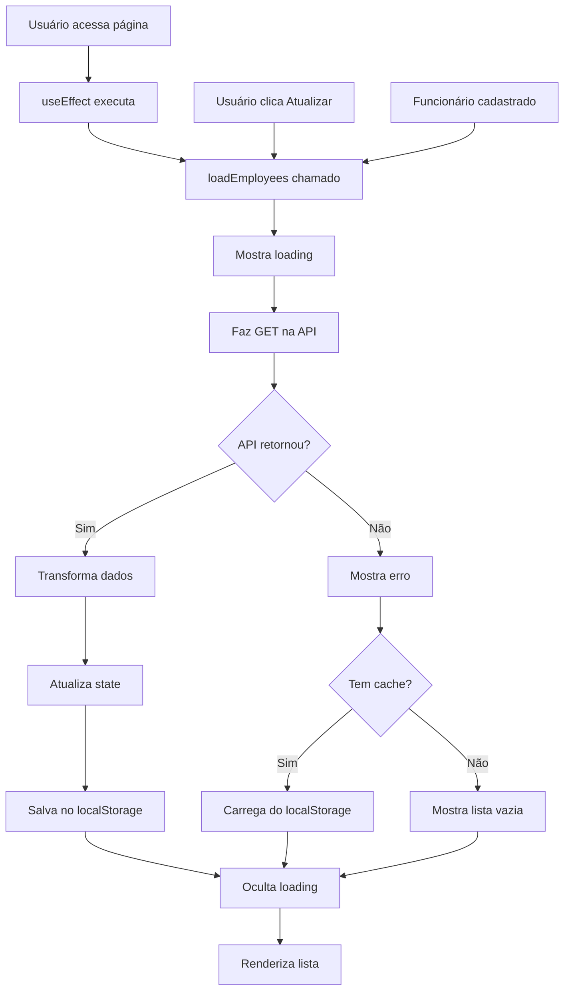

# Teste de API - Obter Funcionários

## 📋 Visão Geral

Este documento fornece instruções para testar a integração com a API de obtenção de funcionários cadastrados.

## 🔧 Configuração

### Variáveis de Ambiente

Certifique-se de que o arquivo `.env` contém:

```env
NEXT_PUBLIC_OBTER_FUNCIONARIO_ENV=https://n8n-n8n.tscd6m.easypanel.host/webhook/d312e11d-6928-4272-8d18-cf51360f4c9a
```

⚠️ **Importante**: A variável com `NEXT_PUBLIC_` é exposta no cliente (browser).

## 🧪 Teste Manual via cURL

### Exemplo de Requisição

```bash
curl -X GET https://n8n-n8n.tscd6m.easypanel.host/webhook/d312e11d-6928-4272-8d18-cf51360f4c9a \
  -H "Content-Type: application/json"
```

### Resposta Esperada

A API retorna um array de funcionários:

```json
[
  {
    "NOME": "matheus costa",
    "MATRICULA": "251013698",
    "DATA_NASCIMENTO": "10/01/2007",
    "id": 1,
    "createdAt": "2025-11-08T17:12:48.080Z",
    "updatedAt": "2025-11-08T17:12:48.080Z"
  },
  {
    "NOME": "João Silva",
    "MATRICULA": "123456",
    "DATA_NASCIMENTO": "15/06/1990",
    "id": 2,
    "createdAt": "2025-11-08T17:33:13.579Z",
    "updatedAt": "2025-11-08T17:33:13.579Z"
  }
]
```

⚠️ **Formato da Data**: A API retorna datas no formato `DD/MM/YYYY`.

## 🌐 Teste via Aplicação Web

### 1. Inicie o servidor de desenvolvimento

```bash
npm run dev
```

### 2. Acesse o painel de gerenciamento

Navegue para: `http://localhost:3000/dashboard/employees`

⚠️ **Nota**: Esta é uma rota privada. Você precisa estar autenticado.

### 3. Funcionamento Automático

A lista de funcionários é carregada automaticamente quando você:

- ✅ Acessa a página pela primeira vez
- ✅ Clica no botão "Atualizar" (ícone de refresh)
- ✅ Cadastra um novo funcionário com sucesso
- ✅ Edita um funcionário existente

### 4. Observe o comportamento

#### ✅ Sucesso

- Loading spinner enquanto carrega
- Lista de funcionários aparece
- Mensagem no console: "X funcionário(s) obtido(s) da API"
- Dados sincronizados com localStorage

#### ❌ Erro

- Mensagem vermelha no topo da lista
- Se houver dados no cache, exibe: "Exibindo dados do cache local"
- Se não houver cache: "Verifique sua conexão e tente novamente"
- Console mostra detalhes do erro

## 🔄 Atualização da Lista

### Automática

A lista é atualizada automaticamente após:

1. Cadastro de novo funcionário
2. Edição de funcionário existente

### Manual

Clique no botão **"Atualizar"** (ícone de refresh) para recarregar da API.

## 🔍 Transformação de Dados

A aplicação transforma os dados da API para o formato interno:

### API → Aplicação

```typescript
// Dados da API
{
  "NOME": "matheus costa",
  "MATRICULA": "251013698",
  "DATA_NASCIMENTO": "10/01/2007",
  "id": 1,
  "createdAt": "2025-11-08T17:12:48.080Z",
  "updatedAt": "2025-11-08T17:12:48.080Z"
}

// Transformado para formato interno
{
  id: "1",
  name: "matheus costa",
  matricula: "251013698",
  dataNascimento: "2007-01-10",  // DD/MM/YYYY → YYYY-MM-DD
  createdAt: "2025-11-08T17:12:48.080Z"
}
```

### Transformação de Data

```typescript
// API: "10/01/2007" (DD/MM/YYYY)
const [day, month, year] = apiEmployee.DATA_NASCIMENTO.split("/");
const dataNascimento = `${year}-${month}-${day}`;
// Resultado: "2007-01-10" (YYYY-MM-DD)
```

## 📊 Estrutura da Resposta da API

### Campos Retornados

| Campo             | Tipo   | Descrição                      | Exemplo                    |
| ----------------- | ------ | ------------------------------ | -------------------------- |
| `NOME`            | string | Nome completo do funcionário   | "matheus costa"            |
| `MATRICULA`       | string | Número da matrícula            | "251013698"                |
| `DATA_NASCIMENTO` | string | Data no formato DD/MM/YYYY     | "10/01/2007"               |
| `id`              | number | ID único do funcionário        | 1                          |
| `createdAt`       | string | Data de criação (ISO 8601)     | "2025-11-08T17:12:48.080Z" |
| `updatedAt`       | string | Data de atualização (ISO 8601) | "2025-11-08T17:12:48.080Z" |

### Exemplo Completo

```json
[
  {
    "NOME": "Maria Silva Santos",
    "MATRICULA": "987654321",
    "DATA_NASCIMENTO": "22/03/1985",
    "id": 3,
    "createdAt": "2025-11-08T18:00:00.000Z",
    "updatedAt": "2025-11-08T18:00:00.000Z"
  }
]
```

## 🔍 Debugging

### Console do Navegador

1. Abra DevTools (F12)
2. Vá para a aba **Console**
3. Procure por:

```javascript
Buscando funcionários da API: https://n8n-n8n...
4 funcionário(s) obtido(s) da API
4 funcionário(s) carregado(s) da API
```

### Aba Network

1. Abra DevTools (F12)
2. Vá para a aba **Network**
3. Acesse a página ou clique em "Atualizar"
4. Procure pela requisição GET para o webhook
5. Verifique:
   - **Status**: 200 OK
   - **Response**: Array de funcionários
   - **Timing**: Tempo de resposta

### Logs de Erro

Em caso de erro, o console mostrará:

```javascript
Erro ao buscar funcionários: Error: Erro HTTP: 500 - Internal Server Error
Erro ao carregar funcionários: Error: ...
4 funcionário(s) carregado(s) do localStorage (fallback)
```

## 💾 Cache e Sincronização

### localStorage como Backup

Após cada busca bem-sucedida:

1. ✅ Dados são salvos no `localStorage`
2. ✅ Em caso de erro futuro, dados do cache são exibidos
3. ✅ Mensagem informa que está usando cache

### Verificar Cache no Console

```javascript
// Ver funcionários no cache
const employees = JSON.parse(localStorage.getItem("employees") || "[]");
console.table(employees);

// Contar funcionários
console.log(`Total no cache: ${employees.length}`);
```

## ⚠️ Tratamento de Erros

### Erros Comuns e Soluções

#### 1. "URL da API não configurada"

**Causa**: Variável de ambiente não encontrada  
**Solução**:

- Verifique `.env` com `NEXT_PUBLIC_OBTER_FUNCIONARIO_ENV`
- Reinicie o servidor (`npm run dev`)

#### 2. "Erro de conexão"

**Causa**: Falha na rede  
**Solução**:

- Verifique internet
- Teste com curl no terminal
- Verifique se webhook está ativo no n8n

#### 3. "Erro HTTP: 404"

**Causa**: Webhook não encontrado  
**Solução**:

- Verifique URL no `.env`
- Verifique se workflow está ativo no n8n

#### 4. "Erro HTTP: 500"

**Causa**: Erro no servidor  
**Solução**:

- Verifique logs do n8n
- Verifique banco de dados
- Contate administrador

#### 5. Lista vazia apesar de ter dados

**Causa**: Filtro de busca ativo  
**Solução**: Limpe o campo de busca

## 🎯 Fluxo Completo



## ✨ Melhorias Implementadas na Página

### 1. Loading State

- ✅ Spinner animado enquanto carrega
- ✅ Campos desabilitados durante loading
- ✅ Texto "Carregando funcionários..."

### 2. Tratamento de Erros

- ✅ Card vermelho com ícone de alerta
- ✅ Mensagem descritiva do erro
- ✅ Informação sobre cache (se disponível)

### 3. Botão de Atualização

- ✅ Ícone de refresh que gira durante loading
- ✅ Tooltip "Atualizar lista"
- ✅ Responsive (texto oculto em mobile)

### 4. Informações Detalhadas

- ✅ Nome em destaque (fonte maior)
- ✅ Matrícula e data de nascimento formatada
- ✅ Data de cadastro com hora completa
- ✅ Tooltips nos botões de ação

### 5. Empty State Melhorado

- ✅ Mensagem contextual (sem dados vs busca)
- ✅ Botão para cadastrar primeiro funcionário
- ✅ Visual limpo e amigável

### 6. Responsividade

- ✅ Grid adaptativo (1 col mobile, 3 cols desktop)
- ✅ Texto do botão "Novo" oculto em mobile
- ✅ Ícones sempre visíveis
- ✅ Cards com hover effect

## ✅ Checklist de Teste

### Carregamento Inicial

- [ ] Servidor de desenvolvimento rodando
- [ ] Variável de ambiente configurada
- [ ] Acessa página `/dashboard/employees`
- [ ] Loading aparece
- [ ] Lista carrega automaticamente
- [ ] Console mostra logs de sucesso
- [ ] Network mostra requisição GET

### Atualização Manual

- [ ] Clica no botão "Atualizar"
- [ ] Ícone gira durante loading
- [ ] Lista é recarregada
- [ ] Console mostra nova requisição

### Tratamento de Erro

- [ ] Desconectar internet
- [ ] Acessar página ou clicar em "Atualizar"
- [ ] Mensagem de erro aparece
- [ ] Se houver cache, lista é exibida
- [ ] Mensagem indica que está usando cache

### Sincronização

- [ ] Cadastrar novo funcionário
- [ ] Lista atualiza automaticamente
- [ ] Novo funcionário aparece na lista
- [ ] Dados sincronizados com API

### Busca

- [ ] Digite no campo de busca
- [ ] Lista filtra em tempo real
- [ ] Busca por nome funciona
- [ ] Busca por matrícula funciona
- [ ] Mensagem apropriada se nada encontrado

## 🚀 Próximos Passos

- [ ] Implementar paginação para muitos registros
- [ ] Adicionar ordenação (nome, matrícula, data)
- [ ] Implementar filtros avançados
- [ ] Adicionar indicador de "dados desatualizados"
- [ ] Implementar pull-to-refresh em mobile
- [ ] Adicionar animações de transição
- [ ] Implementar lazy loading para performance
- [ ] Adicionar opção de exportar lista (CSV, PDF)

## 📞 Suporte

Se encontrar problemas:

1. ✅ Verifique console do navegador
2. ✅ Verifique aba Network
3. ✅ Teste URL com curl
4. ✅ Verifique variável de ambiente
5. ✅ Verifique webhook no n8n
6. ✅ Revise este documento
7. ✅ Entre em contato com a equipe

## 📝 Notas Importantes

- A API usa método **GET** (não POST)
- Formato de data da API: **DD/MM/YYYY**
- Formato interno: **YYYY-MM-DD**
- Cache é atualizado a cada busca bem-sucedida
- Em caso de erro, cache é usado como fallback
- IDs da API são numbers, convertidos para strings internamente
